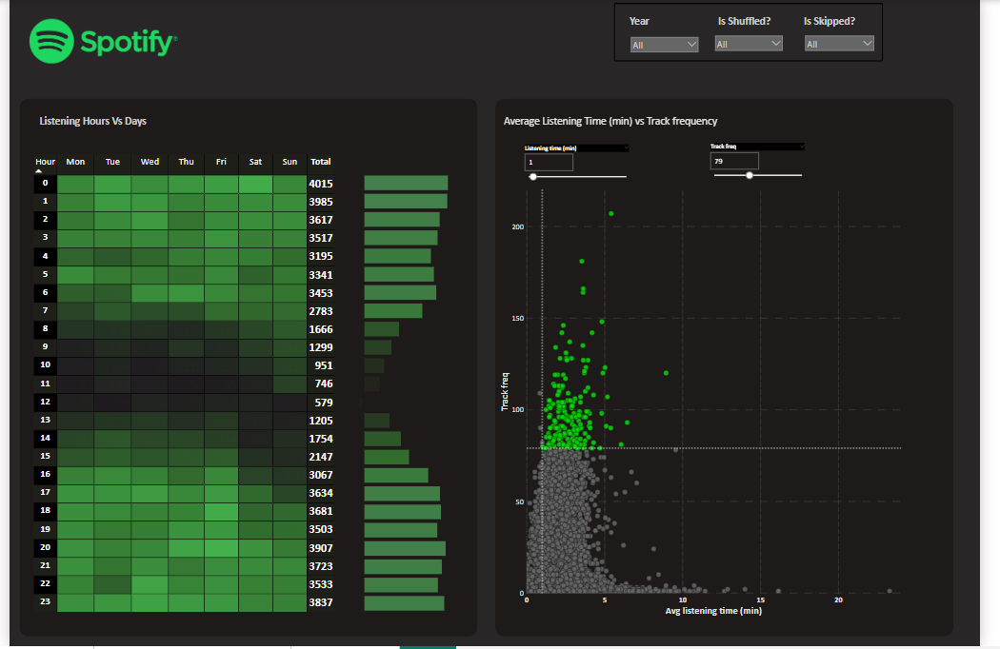

# Spotify_powerBI

#  Spotify Listening Trends Dashboard

This Power BI project analyzes user listening behavior on Spotify, exploring trends in album, artist, and track engagement over time. It includes key visualizations, DAX measures, and interactive features to support meaningful insights.

## Project Overview

**Objective:**  
To uncover listening patterns on Spotify by visualizing and analyzing data across multiple dimensions such as albums, artists, tracks, time of day, and year-over-year changes.

**Tools Used:**  
- Power BI  
- DAX  
- Data Modeling  
- Excel/CSV (for data source)

##  Features & Visuals

-  **Time Trends:** Albums, Artists, and Tracks played over months and years  
-  **Listening Habits:** Weekday vs Weekend activity  
-  **Top 5 Visuals:** Most played Albums, Artists, and Tracks  
-  **Heatmap:** Listening activity by hour and weekday  
-  **Quadrant Analysis:** Track frequency vs listening time  
-  **Drill-through & Export:** Interactive table with drill-down and CSV export capability

---

##  Dashboard Screenshots

| Dashboard Page | Preview |
|----------------|---------|
| Album & Artist Trends | ![Albums] |
| Listening Heatmap |  |
| Quadrant Analysis |  |

##  Live Demo (Optional)
*Coming Soon – Will be hosted via Power BI publish-to-web*

---

##  Project Structure

spotify_powerBI
│
├── README.md
├── SpotifyDashboard.pbix # Power BI file (optional if public)
├── screenshots/ # Folder with dashboard images
│ ├── album_trends.png
│ ├── heatmap.png
│ └── quadrant_analysis.png
└── data/ # Sample or mock data 

## Key Learnings

- Practiced end-to-end data visualization pipeline in Power BI
- Applied DAX for dynamic KPIs, YoY comparisons, and custom metrics
- Designed user-friendly dashboard with interactivity and storytelling

## Author

**Shreel Chawla**  
LinkedIn: (https://www.linkedin.com/in/shreel-chawla-7a8a2a256/) 
Email: shreel.chawla@iitgn.ac.in

